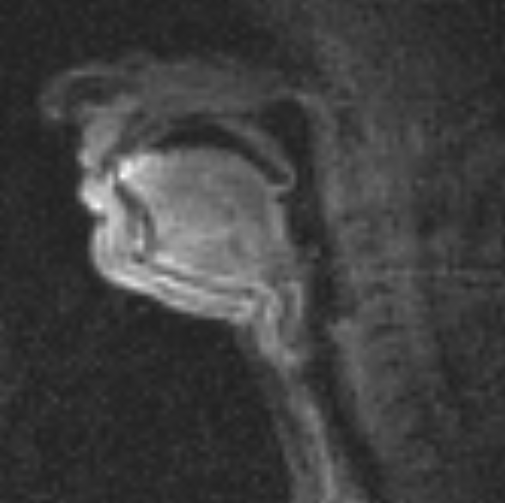
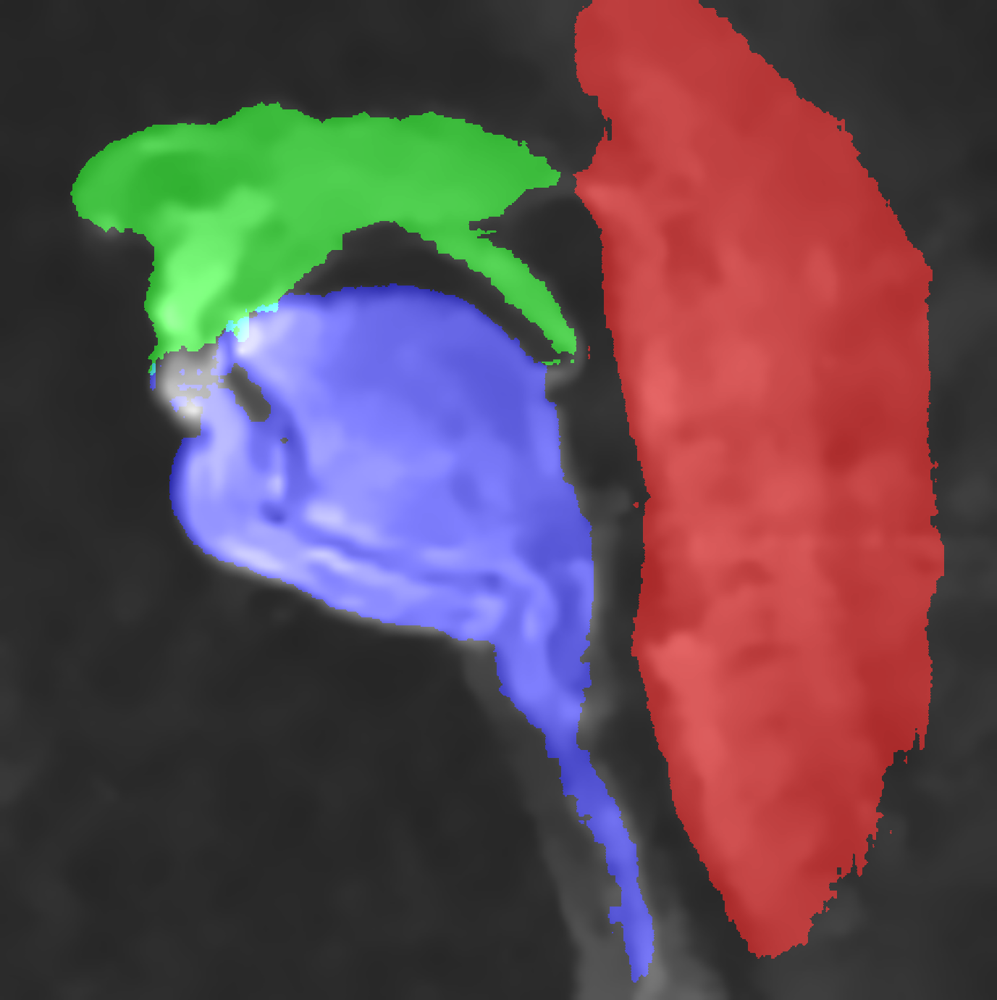
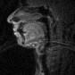
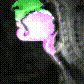

# SPAM

SPAM is an automated MRI segmentation tool designed to be generalizable, easily accessible, and lightweight. SPAM segments an MRI image into three distinct vocal articulator regions. SPAM is currently supported on USC's Redondo and CARC servers.

Install Instructions:

```bash
# clone repository
git clone https://github.com/mamarcus64/SPAM.git

# create and activate conda environment
conda create -n spam python=3.11.10
conda activate spam
cd SPAM/segment-anything-2
pip install -e .
cd ..

# run SPAM!
python src/run_spam.py assets/test_image.png --output-type image --output-folder assets
```
Example output for an image:
<p float="left">
  
  
</p>

Example output for a video:
<p float="left">
  
  
</p>

Detailed documentation (also viewable via `python src/run_spam.py --help`):
```
usage: python src/run_spam.py [-h] [--output-type {image,numpy,RLE}] [--output-folder o] [--resize-to-512] file

MRI Image Segmentation Tool

This tool accepts a single input file (image or video) and performs automatic segmentation.
The input file must be compatible with OpenCV. Supported formats include:

Images: .bmp, .dib, .jp2, .jpe, .jpeg, .jpg, .pbm, .pgm, .png, .ppm, .ras, .sr, .tif, .tiff, .webp
Videos: .3g2, .3gp, .avi, .flv, .mkv, .mov, .mp4, .mpeg, .mpg, .webm, .wmv

The output can be saved in one or more formats: rendered pictures, NumPy arrays, or Run Length Encodings (RLE).


positional arguments:
  file                  Path to an input image or video file. Must be a format supported by OpenCV.

options:
  -h, --help            show this help message and exit
  --output-type {image,numpy,RLE} [{image,numpy,RLE} ...], -t {image,numpy,RLE} [{image,numpy,RLE} ...]
                        Specify one or more output types for the segmentation results.
                        Choose from: "image", "numpy", "RLE".
                        Example: --output-type image numpy
  --output-folder OUTPUT_FOLDER, -o OUTPUT_FOLDER
                        Directory to save output files. Defaults to the current working directory.
  --resize-to-512       Images are scaled to 512x512 pixels during segmentation
                        and then scaled back to the original image size afterwards.
                        Set this flag to keep the images as 512x512.
  --device {cpu,cuda}   Device to run segmentation on.
                        "cpu" forces CPU usage.
                        "cuda" (default) forces GPU usage (fails if unavailable).
```

Some notes:
- Code is currently set up to run on Redondo. View `src/config.py` to change this.
- Current supported output types are `image`, `numpy`, and `RLE`. You can specify to output one or more output types (i.e., `--output-type RLE image`):
    - `image` returns the original image with the segments blended on top.
    - `numpy` returns a 3xWxH binary array (or Fx3xWxH for videos), where 1's represent the segment locations.
    - `RLE` returns a [Run-Length Encoding](https://en.wikipedia.org/wiki/Run-length_encoding) of the three segmentations.
