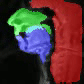

# SPAM

Install Instructions:

```bash
# clone repository
git clone https://github.com/mamarcus64/SPAM.git

# create and activate conda environment
conda create -n spam python=3.11.10
conda activate spam
cd SPAM/segment-anything-2
pip install -e .
cd ..

# run SPAM!
python src/run_spam.py assets/test_image.png --output-type image --output-folder assets
```
Example output for an image:
<p float="left">
  
  
</p>

Example output for a video:
<p float="left">
  
  
</p>